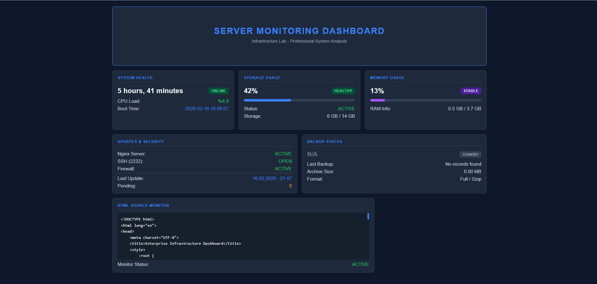

# 🚀 Junior SysAdmin Monitoring Dashboard

Bu proje, bir Linux sunucusunun sistem kaynaklarını ve kritik servislerini anlık olarak takip eden, modern ve kullanıcı dostu bir izleme panelidir.

## 🛠 Özellikler (Features)
- **Anlık Sistem Metrikleri:** CPU yükü, RAM kullanımı ve disk alanı takibi.
- **Servis Denetimi:** Nginx, SSH (Port 2222) ve UFW güvenlik duvarı durum kontrolü.
- **Otomatik Veri Enjeksiyonu:** Bash script (`server_init.sh`) ile sistemden alınan verilerin HTML şablonuna otomatik işlenmesi.
- **Profesyonel Terminal Logları:** Script çalışırken Türkçe ve İngilizce detaylı bilgilendirme yapar.

## 📸 Ekran Görüntüsü (Preview)
Projenin çalışan halinden bir kare:


## 📁 Proje Yapısı (Structure)
- `index.html`: Dashboard'un görsel arayüzü.
- `scripts/server_init.sh`: Veri toplayan ve paneli güncelleyen ana motor.
- `assets/screenshots/`: Proje tanıtım görselleri.

## 🚀 Kurulum ve Kullanım (Usage)
1. Scripti çalıştırılabilir hale getirin:
   ```bash
   chmod +x scripts/server_init.sh
